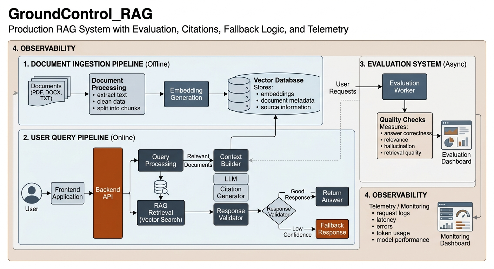

# GroundControl RAG

A production-grade Retrieval Augmented Generation platform that lets users query multi-domain knowledge bases (internal docs, customer support content, technical references) using natural language. Every response is grounded in retrieved source documents with citations, scored by an evaluation engine, and protected by fallback logic that refuses to hallucinate when evidence is weak.

**Core value:** Users get grounded, cited answers from company knowledge — and the system tells you when it doesn't know rather than making things up.

---

## Architecture Overview



GroundControl RAG is built as an in-process FastAPI monolith for v1. All pipeline stages — embedding, retrieval, reranking, generation, validation, and evaluation — run inside the same FastAPI process. This is intentional: at fewer than 1,000 documents, the per-request throughput does not justify separate microservices, and in-process architecture dramatically reduces debugging complexity. Each service is behind a clean interface boundary so individual components can be extracted to separate workers in v2 when telemetry data justifies it.

The system has three distinct pipelines:

---

## Pipeline 1: Document Ingestion (Offline)

Admins upload documents via drag-and-drop. The ingestion pipeline runs as a background task.

```
Admin uploads file (PDF / DOCX / TXT)
    │
    ▼
POST /admin/documents  [multipart/form-data]
    │
    ▼
FastAPI — JWT check (admin role required)
    │
    ▼
Ingestion Service
    ├── Parse file → raw text + page numbers + section headers
    ├── Chunk text → 512 tokens, 64-token overlap, sentence-boundary-aware
    ├── Embed chunks → sentence-transformers all-MiniLM-L6-v2 → vector[384]
    ├── Write to ChromaDB → collection: "documents_v1", cosine similarity
    └── Write to PostgreSQL → documents + document_chunks tables
    │
    ▼
Return {document_id, chunk_count, status: "ingested"}
```

PostgreSQL write is last so `embedding_id` references the ChromaDB-assigned ID. The ingestion state machine (`pending → chunking → embedding → indexing → complete`) prevents orphaned records if the process crashes mid-way.

---

## Pipeline 2: Query (Online, Synchronous)

The user-facing pipeline. Target response time is 1–2 seconds.

```
User submits a question
    │
    ▼
POST /query  {question: "..."}
    │
    ▼
FastAPI — JWT check, generate request_id, start telemetry context
    │
    ▼
Query Processing — normalize text, extract search terms
    │
    ▼
Embedding Service — embed query → vector[384]
    │
    ▼
Retrieval Service — ChromaDB similarity search → top 20 candidate chunks
    │
    ▼
Reranker — cross-encoder (ms-marco-MiniLM-L-6-v2) scores all 20 pairs
         — selects top 5 by rerank score
    │
    ▼
Context Builder — assembles prompt:
    SYSTEM: "Answer only from the context below."
    CONTEXT: [SOURCE 1]: ... [SOURCE 2]: ... [SOURCE 3]: ... (top 5 chunks)
    QUESTION: "{user_question}"
    │
    ▼
LLM Service — Claude API (temperature=0, pinned model version)
            — captures: response_text, input_tokens, output_tokens, latency_ms
    │
    ▼
Citation Generator — parses [SOURCE N] references from response
                   — resolves to {filename, page, section} from chunk metadata
    │
    ▼
Response Validator
    ├── confidence >= threshold → return cited answer
    └── confidence < threshold → Fallback Handler
                               → "I could not find reliable information on this topic."
    │
    ▼
Commit telemetry to PostgreSQL (ai_requests row)
    │
    ▼
Dispatch evaluation to BackgroundTask (fire-and-forget — does not block response)
    │
    ▼
Return response to user
```

The evaluation dispatch happens after the telemetry commit but before `return`. The response reaches the user in ~1–2 seconds; evaluation completes ~3–5 seconds later, asynchronously.

---

## Pipeline 3: Evaluation (Async, Non-Blocking)

Every response is evaluated after it is returned to the user. Three LLM-as-judge calls run in sequence via FastAPI `BackgroundTasks`.

```
BackgroundTask receives {request_id, question, context_chunks, answer}
    │
    ▼
Evaluation Engine
    ├── Faithfulness — "Does the answer only contain claims supported by the context?" → 0.0–1.0
    ├── Relevance    — "Does the answer address the question?"                         → 0.0–1.0
    └── Correctness  — keyword overlap heuristic or LLM judge                         → 0.0–1.0
    │
    ▼
INSERT INTO evaluations (request_id, faithfulness_score, relevance_score, correctness_score)
    │
    ▼
Admin dashboard reads scores on next poll
```

Evaluation uses explicit rubrics with score anchors and calibration examples at temperature=0 to prevent score inflation (the common failure mode where a judge returns 0.85 for everything regardless of quality).

---

## Component Map

| Component | Layer | Responsibility |
|-----------|-------|---------------|
| React Frontend | Client | Query chat UI, admin dashboard, file upload drag-and-drop |
| FastAPI Gateway | API | Auth enforcement, request ID generation, routing, telemetry capture |
| Auth Middleware | API Cross-Cut | JWT validation, role check (user vs admin) |
| Ingestion Service | Offline Pipeline | Parse → chunk → embed → write ChromaDB + PostgreSQL |
| Embedding Service | Shared | `all-MiniLM-L6-v2` — single source of truth for all vectors |
| ChromaDB | Storage | Vector persistence, cosine similarity search, metadata filtering |
| Retrieval Service | Online Pipeline | Similarity search — returns top 20 candidates |
| Reranker | Online Pipeline | Cross-encoder re-scores top 20, selects top 5 |
| Context Builder | Online Pipeline | Assembles system prompt + numbered source chunks + question |
| LLM Service | Online Pipeline | Claude API call — captures token counts and latency |
| Citation Generator | Online Pipeline | Parses `[SOURCE N]` references, maps to chunk metadata |
| Response Validator | Online Pipeline | Grounding + confidence threshold gate; routes to fallback if weak |
| Fallback Handler | Online Pipeline | Returns "I don't know" when evidence is insufficient |
| Evaluation Engine | Async | LLM-as-judge scoring via BackgroundTasks — never blocks the response |
| Telemetry Collector | Cross-Cut | Per-stage latency, token usage, retrieval scores written to `ai_requests` |
| PostgreSQL | Storage | users, documents, document_chunks, ai_requests, evaluations |
| Admin Dashboard | Client | Stats, latency charts, request explorer, document list |

---

## Database Schema

```
users               — id, email, hashed_password, role (user|admin), created_at
documents           — id, filename, source, domain_tag, status, uploaded_at
document_chunks     — id, document_id, content, embedding_id, page, section, chunk_index
ai_requests         — id, user_id, question, answer, model, input_tokens, output_tokens,
                       embed_ms, retrieve_ms, rerank_ms, generate_ms, validate_ms,
                       retrieval_scores, fallback_triggered, created_at
evaluations         — id, request_id, faithfulness_score, relevance_score, correctness_score
```

---

## Tech Stack

### Backend

| Technology | Version | Purpose |
|------------|---------|---------|
| Python | 3.12 | Runtime |
| FastAPI | 0.136.3 | API framework — async-native, automatic OpenAPI docs |
| Uvicorn | 0.49.0 | ASGI server |
| Pydantic | 2.13.4 | Data validation (v2 — 5–50x faster via Rust core) |
| SQLAlchemy | 2.0.50 | Async ORM |
| asyncpg | 0.31.0 | Fastest async PostgreSQL driver |
| Alembic | 1.18.4 | Database migrations |
| anthropic | 0.109.1 | Claude API — generation AND LLM-as-judge evaluation |
| sentence-transformers | 5.5.1 | Embeddings — `all-MiniLM-L6-v2`, runs locally, no external API |
| chromadb | 1.5.9 | Vector store — local persistent mode, < 1K docs |
| PyJWT | 2.13.0 | JWT auth (not python-jose — has CVEs) |
| bcrypt | 5.0.0 | Password hashing (not passlib — low maintenance) |
| tenacity | 9.1.4 | Retry logic for LLM API calls |
| structlog | 26.1.0 | Structured JSON logging for per-request telemetry |

### Frontend

| Technology | Version | Purpose |
|------------|---------|---------|
| React | 19.2.7 | UI framework |
| TypeScript | 6.0.3 | Type safety |
| Tailwind CSS | 4.3.1 | Styling — v4 CSS-first engine, no config file |
| Vite | 8.0.16 | Build tool |
| React Router | 7.17.0 | Client routing |
| TanStack Query | 5.101.0 | Server state / async data fetching |
| Zustand | 5.0.14 | Client state (auth + UI) |
| Recharts | 3.8.1 | Admin dashboard charts |
| Axios | 1.17.0 | HTTP client with JWT interceptors |

### Infrastructure

| Technology | Version | Purpose |
|------------|---------|---------|
| Docker Compose | v2 | Single `docker-compose up` runs everything |
| PostgreSQL | 16-alpine | Relational store |
| ChromaDB | chromadb/chroma:latest | Vector DB with persistent volume mount |

---

## Project Structure

```
GroundControl_RAG/
├── backend/
│   ├── app/
│   │   ├── api/v1/          # Route handlers
│   │   ├── core/            # Config, security, lifespan
│   │   ├── models/          # SQLAlchemy ORM models
│   │   └── services/        # Embedding, ingestion, retrieval, evaluation
│   ├── alembic/             # Database migrations
│   ├── tests/               # pytest + pytest-asyncio
│   ├── Dockerfile
│   └── requirements.txt
├── frontend/                # React + TypeScript + Tailwind (Phase 5)
├── docker-compose.yml       # Orchestrates FastAPI + PostgreSQL + ChromaDB
├── .planning/               # GSD planning artifacts
│   ├── PROJECT.md           # Requirements and constraints
│   ├── ROADMAP.md           # 5-phase roadmap
│   └── phases/01-foundation # Phase plans and research
└── images/
    └── system_overview.png
```

---

## Build Phases

The system is built in dependency order — each phase unblocks the next.

| Phase | Goal | Key Deliverables |
|-------|------|-----------------|
| **1. Foundation** | Docker Compose runs, users can register and authenticate | PostgreSQL schema, JWT auth middleware, health checks, `docker-compose up` green |
| **2. Ingestion Pipeline** | Admin uploads a document and it is retrievable in ChromaDB | PDF/DOCX/TXT parser, chunker, Embedding Service, ChromaDB init, `POST /admin/documents` |
| **3. Query Pipeline** | Users get cited, grounded answers or a graceful refusal | Retrieval, reranker, context builder, Claude generation, citation parser, fallback gate |
| **4. Telemetry and Evaluation** | Every request is instrumented and every answer is scored | TelemetryContext, stage timing, `ai_requests` inserts, LLM-as-judge BackgroundTasks |
| **5. Frontend** | Chat UI for users, monitoring dashboard for admins | React query interface with inline citations, admin stats + request explorer |

---

## Key Design Decisions

**Embeddings: sentence-transformers, not OpenAI or Anthropic**
Anthropic has no standalone embeddings API. Running `all-MiniLM-L6-v2` locally (80MB, ~10ms/chunk on CPU) eliminates a second external vendor dependency, removes network latency per chunk, and costs nothing. The model name is pinned in config — changing it after ingestion requires re-embedding all documents.

**Single embedding service as the authoritative vector source**
Both ingestion and query time call the same `EmbeddingService` singleton. Embeddings are passed manually to ChromaDB rather than using ChromaDB's built-in embedding function. This prevents model drift between stored and queried vectors — a failure mode that collapses retrieval silently with no error.

**Cross-encoder reranking over vector similarity alone**
The initial retrieval returns 20 candidates by cosine similarity. A cross-encoder then re-scores all 20 query-chunk pairs and selects the top 5. This improves NDCG@5 by 15–25% for policy documents where user phrasing varies from document language.

**Evaluation is async and never on the hot path**
Three LLM-as-judge calls add ~3–6 seconds of latency. Dispatching them via FastAPI `BackgroundTasks` after the response is returned keeps user-facing latency at 1–2 seconds. Celery and Redis are not needed at v1 throughput.

**Custom LLM-as-judge over RAGAS**
RAGAS requires OpenAI embeddings by default and is harder to tune. Custom Claude prompts with explicit rubrics and calibration examples give equivalent signal with full control over scoring thresholds.

**Grounding-enforced fallback**
The Response Validator checks retrieval confidence and grounding before returning. When evidence is insufficient, the system returns a clear "I could not find reliable information" rather than generating a plausible-sounding but unsupported answer. This is the trust differentiator for HR/policy/compliance use cases.

---

## Quick Start

```bash
# Clone and configure
git clone https://github.com/shakin-shahria/GroundControl_RAG.git
cd GroundControl_RAG

# Set required environment variables
cp backend/.env.example backend/.env
# Edit .env — set ANTHROPIC_API_KEY and JWT_SECRET_KEY

# Start all services
docker-compose up
```

Services:
- FastAPI: `http://localhost:8000`
- API docs: `http://localhost:8000/docs`
- PostgreSQL: `localhost:5432`
- ChromaDB: `http://localhost:8001`

Health check: `GET http://localhost:8000/health`

---

## What This System Does Not Do (v1)

- Multi-modal document support (images, video)
- Fine-tuning or model retraining
- Agentic / multi-step workflows
- Multi-tenancy or per-org isolation
- External monitoring stack (Prometheus/Grafana) — lightweight custom dashboard only
- Batch document import CLI — admin UI upload only
